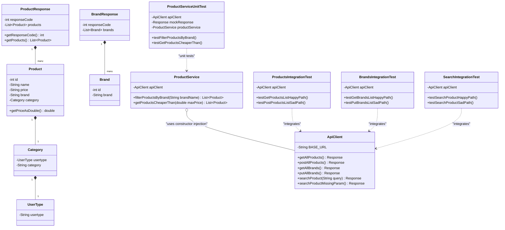

# 🚀 API Test Automation Framework

> A robust, clean, and highly maintainable test automation engine built to validate REST APIs on the **Automation Exercise** platform.

---

<p align="center">
  
  
  
  
  
</p>

---

## 📖 Table of Contents
1. [Key Features](#-key-features)
2. [Project Architecture](#-project-architecture)
3. [Class Diagram](#-class-diagram)
4. [Getting Started](#-getting-started)
5. [CI/CD Pipeline](#-cicd-pipeline)
6. [Collaboration & Hand-over](#-collaboration--hand-over)
7. [Full Stack Analysis & Security Guidelines](#-full-stack-analysis--security-guidelines)
8. [Meet the Collaborators](#-meet-the-collaborators)

---

## ✨ Key Features

*   **POJO Response Mapping**: Uses Jackson ObjectMapper for precise serialisation and deserialisation of API responses.
*   **Decoupled ApiClient**: Isolates HTTP requests and RestAssured settings from the assertions layer.
*   **Automated Content-Type Parsing**: Registers a custom global parser to handle standard HTML-based payloads safely.
*   **Mockito Mocking**: Runs fast offline unit tests for business logic without firing real HTTP requests.
*   **Comprehensive Coverage**: Tests multiple endpoints (`/productsList`, `/brandsList`, `/searchProduct`) under both happy and sad path scenarios.

---

## 🏗️ Project Architecture

```text
api_testing_project
 ├── PROJECT_BOARD.md                 # Scrum Scrum Board representation
 ├── pom.xml                          # Project build and dependencies configuration
 └── src/test/java
      └── com.sparta.api_testing_project
           ├── client
           │    └── ApiClient.java    # Handles RestAssured requests
           ├── pojos                  # Object models mapping response JSON structures
           │    ├── Brand.java
           │    ├── BrandResponse.java
           │    ├── Category.java
           │    ├── Product.java
           │    ├── ProductResponse.java
           │    └── UserType.java
           ├── service
           │    └── ProductService.java # Business logic service utilizing ApiClient
           ├── unit                   # Mockito unit tests for service class
           │    └── ProductServiceUnitTest.java
           └── integration            # RestAssured integration tests
                ├── BrandsIntegrationTest.java
                ├── ProductsIntegrationTest.java
                └── SearchIntegrationTest.java
```

---

## 📊 Class Diagram



---

## 🚀 Getting Started

### Prerequisites
Make sure **JDK 21** and **Maven** are installed on your machine.

### Run Tests
To download dependencies, compile codebase, and run the test suite:
```bash
mvn clean test
```

---

## 🔄 CI/CD Pipeline

The framework has an integrated GitHub Action workflow configured in `.github/workflows/maven.yml`. On every push and Pull Request to `main` or `dev`, it:
1. Provisions an Ubuntu environment.
2. Sets up JDK 21.
3. Caches Maven packages for fast builds.
4. Executes the full test suite (`mvn clean test`).

---

## 🤝 Collaboration & Hand-over

When extending this framework or introducing updates:
1.  **Branching Strategy**:
    *   Create branches off of the `dev` branch.
    *   Name features using `feature/description` pattern.
    *   Integrate to `main` via reviewed Pull Requests.
2.  **POJO Integrity**:
    *   Reflect any endpoint updates in the `pojos` package.
3.  **Offline Logic Testing**:
    *   Write Mockito unit tests in the `unit` package for any logic processing to avoid relying on external resources during fast test runs.

---

## 🛡️ Full Stack Analysis & Security Guidelines

### 🔑 Credentials & Secrets Management
*   **Best Practice**: Avoid hardcoding authentication credentials (e.g. passwords, API keys) inside test files.
*   **Implementation**: Retrieve values dynamically using environment variables (`System.getenv("TEST_USER_PASSWORD")`) or configure local `.properties` files that are ignored by Git. Keep `.env` and `config.properties` registered in your `.gitignore` file.

### 🚦 Rate Limiting & Transient Errors
*   **Best Practice**: Running integration tests continuously on live endpoints can trigger rate limits or web application firewalls.
*   **Implementation**: Configure test retry rules (using libraries like `junit-pioneer`) and include back-off delays if execution volume is high.

### 🧪 Soft Assertions
*   **Best Practice**: Avoid halting test execution on the first minor assertion failure if multiple data fields need to be checked.
*   **Implementation**: Utilise JUnit 5 `Assertions.assertAll()` to execute multiple checks in a single test block and receive a aggregated report of all failures.

### 🧵 Parallel Test Execution
*   **Best Practice**: Minimise build times by running independent integration tests in parallel.
*   **Implementation**: Configure `junit.jupiter.execution.parallel.enabled = true` in `src/test/resources/junit-platform.properties`.

### 📝 Structured Logging
*   **Best Practice**: Decouple test logging from raw standard console stdout.
*   **Implementation**: Direct RestAssured logs to an SLF4J logger facade using logback or log4j2 for structured JSON parsing and aggregation.

---

## 👥 Meet the Collaborators

We are a group of 7 automation and quality assurance experts working together in a Scrum sprint to design, build, and deliver this project.

<br>

<p align="center">
  
</p>

<p align="center">
  <a href="https://github.com/oanzia99">
    
  </a>
  
  
</p>

<p align="center">
  
  
  
</p>
